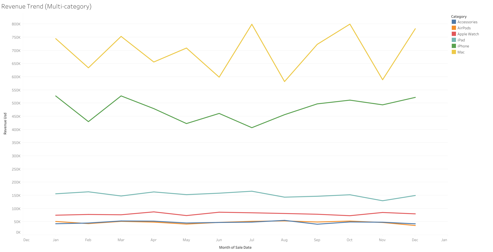
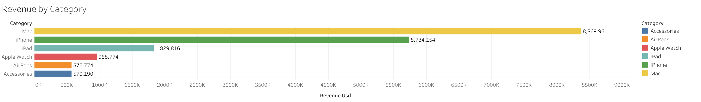
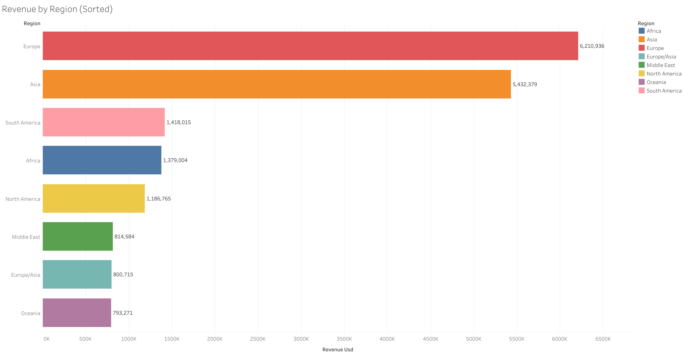
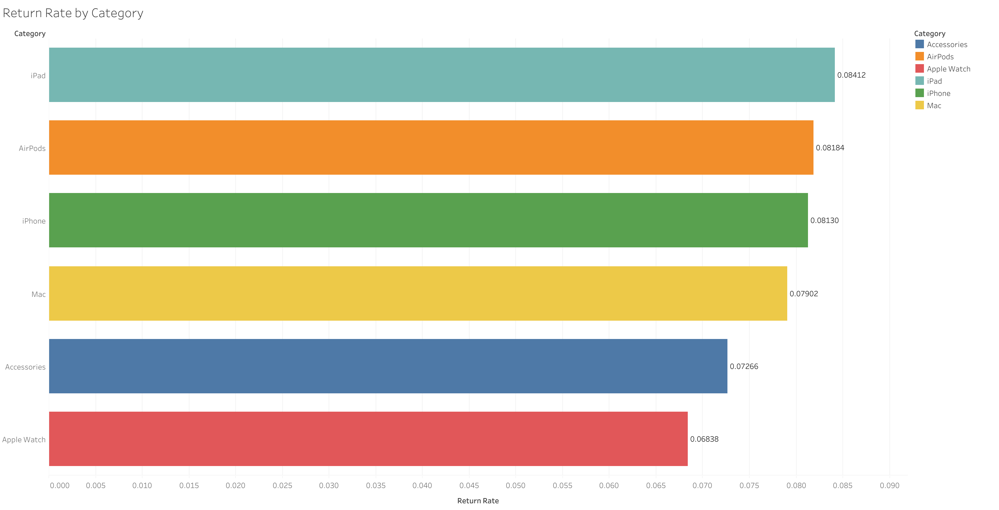
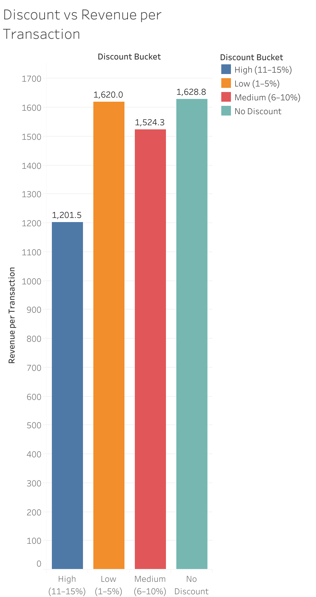
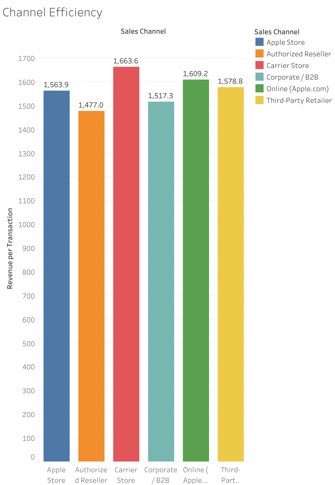

# Revenue Efficiency Optimization (Pricing, Channel & Customer Analysis)

*Case study using a synthetic global product sales dataset based on Apple Inc.'s product ecosystem.*

- Dataset: [Apple Global Product Sales Dataset](https://www.kaggle.com/datasets/ashyou09/apple-global-product-sales-dataset)  
- Tableau Dashboard: [View Interactive Dashboard](https://public.tableau.com/views/RevenueTrendMulti-category/RevenueTrendMulti-category?:language=en-US&:sid=&:redirect=auth&:display_count=n&:origin=viz_share_link)

---

## 1. Background and Overview

In highly competitive consumer electronics markets, revenue growth alone is no longer sufficient. Companies must focus on revenue efficiency, maximizing value per transaction while managing operational risks such as product returns and pricing inefficiencies.

This project analyzes global product sales data to evaluate how **pricing strategies, sales channels, and customer behavior** impact overall revenue efficiency.

Key business questions:
- Which products and regions drive the most revenue?
- Are discount strategies improving or hurting revenue efficiency?
- Which channels generate the highest value per transaction?
- Where are the operational risks (e.g., returns)?

---

## 2. Data Structure Overview

The dataset contains 11,500 transaction-level records across 27 features (2022–2024).

### Key Dimensions:
- **Time**: sale_date, month, quarter  
- **Geography**: region, country, city  
- **Product**: category, product_name  
- **Pricing**: unit_price_usd, discount_pct  
- **Transaction**: units_sold, revenue_usd  
- **Customer**: segment, age group  
- **Operations**: sales_channel, payment_method  
- **Post-purchase**: return_status, customer_rating  

### Derived Metrics:
- Revenue per Transaction  
- Return Rate  
- Discount Bucket  
- Price Tier  

---

## 3. Executive Summary

This analysis reveals four key findings:

1. Revenue is highly concentrated in core product categories (Mac, iPhone, iPad) and regions (Europe and Asia), indicating strong primary drivers but potential dependency risks.

2. Discount strategies show diminishing returns, where higher discounts increase volume but reduce revenue efficiency per transaction.

3. Sales channels perform similarly in efficiency, suggesting limited differentiation and potential missed optimization opportunities.

4. Return rates are relatively consistent across categories, with only minor variation, indicating stable operations but limited differentiation in product risk.

Overall, the business demonstrates strong revenue generation but requires optimization in pricing strategy and channel positioning to improve efficiency.

---

## 4. Insights Deep Dive

### Revenue Trend (Time Series)

  

Revenue shows clear seasonal patterns, with increases toward the end of the year (Q4).

**Insight:**
- Demand is influenced by seasonal cycles, especially year-end periods.

**Implication:**
- Revenue growth is partly driven by timing, not purely performance improvements.

---

### Revenue by Category

  

Top 3 categories:
- Mac  
- iPhone  
- iPad  

**Insight:**
- Revenue is heavily driven by flagship products.

**Implication:**
- Strong product-market fit, but also high dependency risk on a few categories.

---

### Revenue by Region

  

Top regions:
- Europe (~6.2M)  
- Asia (~5.4M)  

Other regions contribute significantly less and show minimal differentiation

**Insight:**
- Revenue is geographically concentrated.

**Implication:**
- Significant untapped growth potential outside core regions.

---

### Return Rate by Category (Aggregate)

  

- Highest: iPad (~8.13%)  
- Lowest: Apple Watch (~6.84%)  
- Others: relatively similar range

**Insight:**
- Return rates are closely clustered across categories

**Implication:**
- No category presents extreme risk, but:
  - iPad may require closer monitoring
  - Overall differentiation in return performance is limited

---

### Discount vs Revenue per Transaction

  

- No Discount: **~1628.8 (highest)**
- Low Discount: **~1620.0**
- Medium Discount: ~1524.3  
- High Discount: **~1201.5 (lowest)**

**Insight:**
- Increasing discounts leads to lower revenue per transaction

**Implication:**
- Discounting destroys value beyond its incremental volume gain

**Efficiency Trade-off:**
- Volume (growth)  
- Value per transaction (dilution)

---

### Channel Efficiency (Revenue per Transaction)

  

- Highest: Carrier Store (~1663.6)  
- Second: Online (Apple.com) (~1609.2)  
- Others: relatively similar (including Apple Store, Resellers, B2B)

**Insight:**
- Channel performance is largely uniform, with only slight differences

**Implication:**
- No channel strongly outperforms others  
- Channels are not strategically differentiated, indicating missed optimization opportunities

---

## 5. Recommendations

- **Reduce high discount usage**  
  Focus on no/low discount strategies to maintain revenue per transaction.

- **Optimize flagship products (Mac & iPhone)**  
  Investigate return spikes and improve product experience during peak periods.

- **Prioritize high-performing channels (Carrier, Online)**  
  Improve efficiency and differentiate channel strategy instead of treating all equally.

- **Expand beyond core regions (Europe & Asia)**  
  Apply localized pricing and targeted market strategies in underperforming regions.

- **Monitor and reduce iPad return rate**  
  Identify root causes and improve product positioning and expectation alignment.
