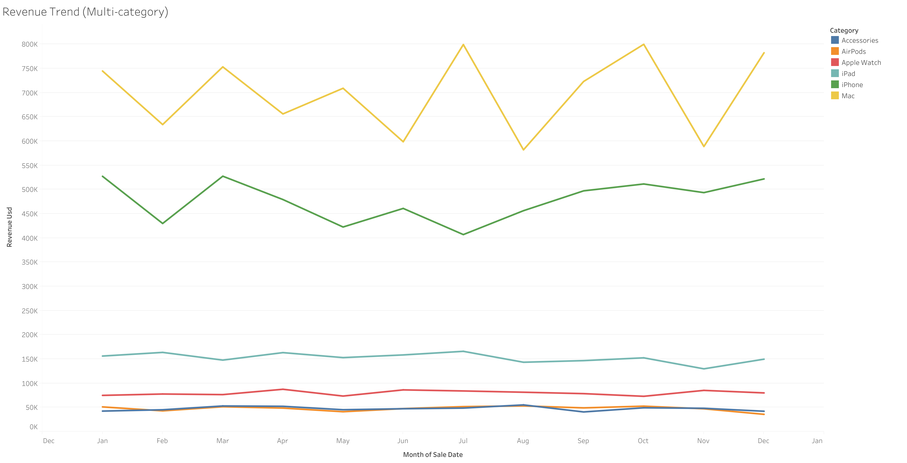
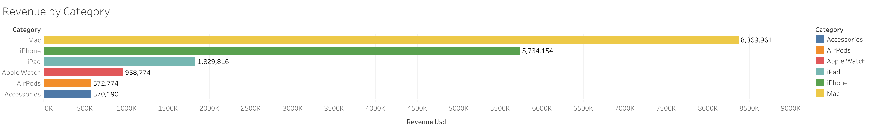
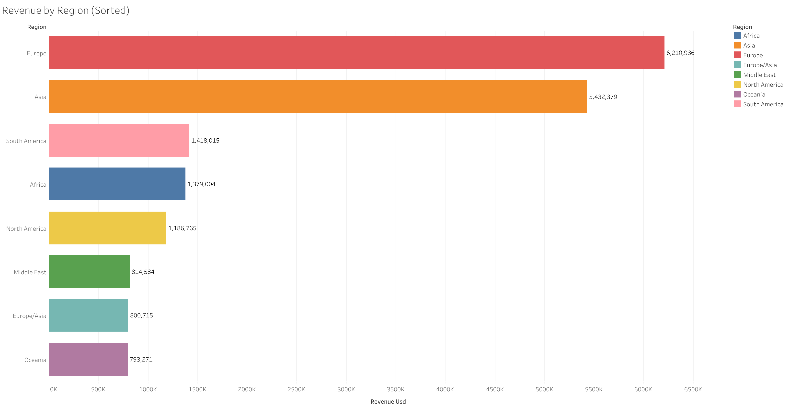
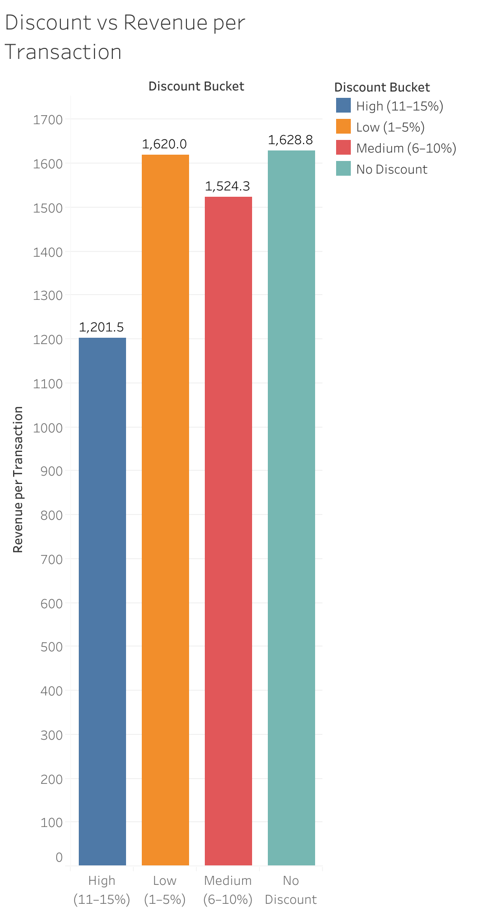
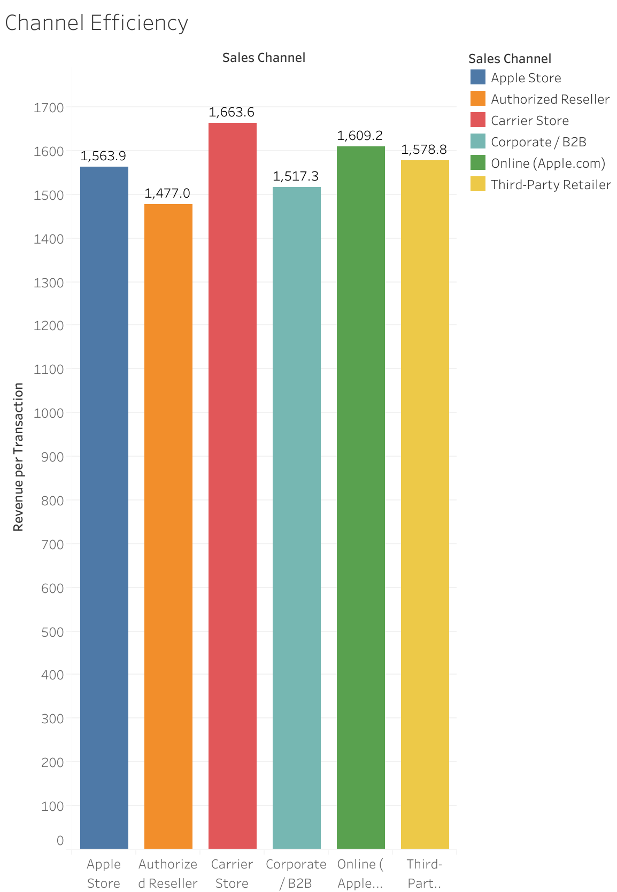
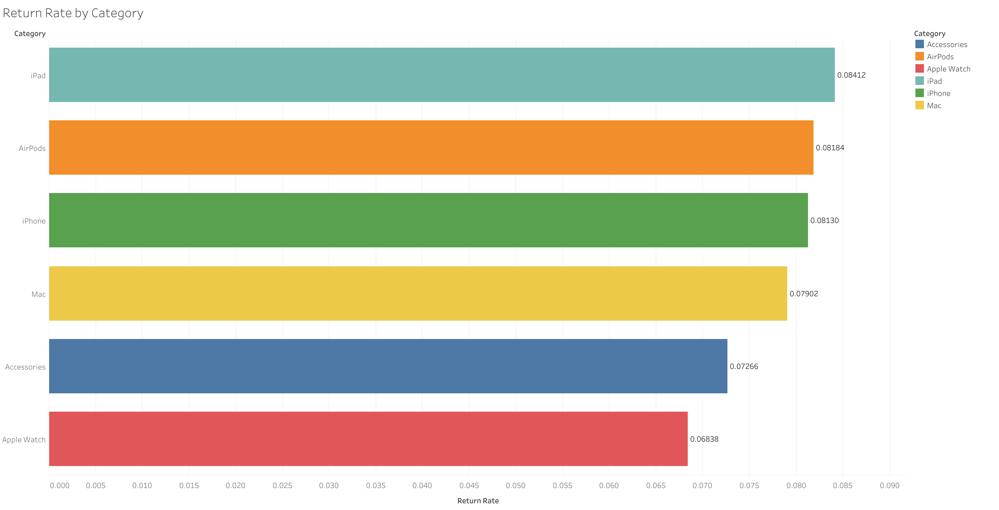

# Revenue Efficiency Optimization: Pricing, Channel & Customer Analysis

*Case study using a synthetic global product sales dataset modeled on a consumer electronics ecosystem (Apple product line), analyzed as if supporting a Commercial Strategy function.*

- **Dataset:** [Apple Global Product Sales Dataset](https://www.kaggle.com/datasets/ashyou09/apple-global-product-sales-dataset)
- **Dashboard:** [Interactive Tableau Dashboard](https://public.tableau.com/views/RevenueTrendMulti-category/RevenueTrendMulti-category?:language=en-US&:sid=&:redirect=auth&:display_count=n&:origin=viz_share_link)
- **Tools:** SQL (data prep and aggregation), Python (EDA and metric derivation), Tableau (dashboarding)

---

## 1. Background and Business Context

Consumer electronics companies are unusually exposed to a specific trap: revenue can grow while the business quietly gets less efficient at generating it. Discounting moves units, flagship products carry the P&L, and channels multiply, but none of that guarantees that each transaction is worth as much as it used to be.

This analysis was framed as if supporting a **Commercial Strategy / Revenue Operations function**, using 2022–2024 transaction-level data to answer a question leadership teams in this sector consistently ask: *are we growing revenue, or are we growing volume while quietly eroding the value of each sale?*

The scope covers four decision areas:

1. **Revenue concentration** — which products and regions the business actually depends on, and how risky that dependency is.
2. **Pricing discipline** — whether discounting is a growth lever or a margin leak, and at what threshold it flips.
3. **Channel strategy** — whether channels are genuinely differentiated or functionally interchangeable.
4. **Operational risk** — where returns are concentrated and whether that risk correlates with the products the business depends on most.

---

## 2. Data Structure Overview

The dataset contains **11,500 transaction-level records across 27 features** (2022–2024), structured across five conceptual layers:

| Layer | Fields | Role in Analysis |
|---|---|---|
| Time | sale_date, month, quarter | Seasonality and trend detection |
| Geography | region, country, city | Revenue concentration mapping |
| Product | category, product_name | Portfolio dependency analysis |
| Pricing & Transaction | unit_price_usd, discount_pct, units_sold, revenue_usd | Revenue efficiency modeling |
| Customer & Operations | segment, age_group, sales_channel, payment_method, return_status, customer_rating | Behavioral and post-purchase risk analysis |

**Derived metrics** built on top of the raw fields:
- Revenue per Transaction (the core efficiency metric this analysis is built around)
- Return Rate by category and by quarter
- Discount Bucket (No / Low / Medium / High)
- Price Tier

---

## 3. Executive Summary

  

Revenue follows a clear seasonal pattern, with consistent upticks toward Q4 each year. That seasonality is the backdrop for the four findings below, and it matters because it means part of any year-over-year revenue gain is timing, not necessarily strategy working better.

Four findings define the state of the business, and they are not independent of each other:

1. **Revenue depends heavily on three products and two regions.** Mac, iPhone, and iPad drive the majority of revenue, and Europe and Asia are the only regions operating at meaningful scale. This is not necessarily a problem, concentration is normal in flagship-driven categories, but it means the discounting and channel decisions made on these specific SKUs and regions carry outsized weight on total revenue efficiency.

2. **Discounting does not fail gradually, it fails at a threshold.** Revenue per transaction barely moves from No Discount ($1,628.8) to Low Discount ($1,620.0), a drop of just **0.5%**. But it accelerates sharply from Low to Medium (**-6.4%** vs. baseline) and then collapses at High Discount (**-26.2%** vs. baseline). This is the single most actionable finding in the dataset: Low Discount is functionally free, while High Discount is where the business is giving away nearly a quarter of transaction value.

3. **Channels are not a strategic lever in their current form.** Carrier Store leads at $1,663.6 per transaction, only **3.4% ahead** of the next-best channel, Online ($1,609.2). A gap this narrow across five channels suggests the business isn't actually differentiating its channel strategy, it's running the same playbook everywhere and getting similar results everywhere.

4. **Returns are a baseline cost of doing business, not a crisis, but iPad deserves a closer look.** Return rates cluster tightly between 6% and 8% across categories, a spread of only 2 percentage points. iPad sits at the top of that range (~8%). Because iPad is also one of the three revenue-driving categories identified in finding #1, even a small, stable-looking return rate compounds into real dollar exposure at iPad's volume.

**The connecting thread:** this business's revenue efficiency problem is not diversification, it's discipline. The products and regions it depends on are fine; the risk is that pricing (discounting past the Medium threshold) and operations (an above-baseline return rate on a top-3 revenue category) are quietly taxing the same small set of products the business relies on most.

---

## 4. Insights Deep Dive

### 4.1 Revenue Concentration: Products and Regions

**Product dependency**

  

- Mac, iPhone, and iPad are the top three revenue-generating categories, meaning the health of three product lines effectively determines the health of total revenue.
- This is a normal pattern for a flagship-driven portfolio, but it also means every pricing or channel decision analyzed below should be read primarily through the lens of these three categories: a discount policy that looks acceptable "on average" can still be damaging if it's disproportionately applied to Mac or iPhone.

**Regional dependency**

  

- Europe (~ $6.2M) and Asia (~ $5.4M) are the two dominant regions; all other regions contribute at materially lower scale with minimal differentiation between them.
- This concentration creates a growth ceiling: without expansion into secondary regions, revenue growth is capped by how much more can be extracted from two already-mature markets, largely through pricing and retention rather than new demand.

**Why this matters together:** revenue concentration on its own is not a red flag. It becomes a risk multiplier when combined with the pricing and return findings below, because it means those effects are landing on the same narrow base of products and geographies rather than being diluted across a wide portfolio.

---

### 4.2 Pricing Discipline: Discount vs. Revenue per Transaction

  

| Discount Tier | Revenue per Transaction | Delta vs. No Discount |
|---|---|---|
| No Discount | $1,628.8 | Baseline |
| Low Discount | $1,620.0 | -0.5% |
| Medium Discount | $1,524.3 | -6.4% |
| High Discount | $1,201.5 | -26.2% |

- The relationship is not linear, it is a **threshold effect**. Low Discount essentially costs nothing in revenue efficiency, which means it's likely a safe, low-risk lever for driving incremental volume.
- The erosion accelerates sharply between Medium and High, more than quadrupling in severity (-6.4% to -26.2%). This suggests High Discount usage isn't just "a bigger version of Medium", it's crossing into a different pricing regime, possibly where discounting is being used reactively (clearing inventory, matching competitor promotions) rather than strategically.
- **Strategic read:** the business likely doesn't need to eliminate discounting, it needs a hard ceiling. Capping most promotional activity at Low-to-Medium and treating High Discount as an exception (not a routine tactic) would protect revenue efficiency without sacrificing the volume benefits of discounting altogether.

---

### 4.3 Channel Strategy: Revenue per Transaction by Channel

  

| Channel | Revenue per Transaction |
|---|---|
| Carrier Store | $1,663.6 |
| Online (Apple.com) | $1,609.2 |
| Apple Store, Resellers, B2B | Comparable range |

- The gap between the top two channels is only **3.4%**, and the remaining channels cluster in a similar range. In a genuinely differentiated channel strategy, you'd expect wider spreads reflecting different customer intents (B2B bulk deals vs. premium in-store experience vs. price-sensitive online shoppers).
- The narrowness of this spread is itself the insight: it implies channels are being managed with a largely uniform pricing and promotion approach, rather than a channel-specific one.
- **Strategic read:** this is a missed-opportunity finding rather than a problem finding. Since Carrier Store already slightly outperforms, it's worth investigating *why*, bundling, less price sensitivity, different customer segment, and testing whether that mechanism can be deliberately extended to Online, the second-highest and highest-volume digital channel.

---

### 4.4 Operational Risk: Return Rates by Category

  

- Return rates range narrowly from ~6% (Apple Watch, lowest) to ~8% (iPad, highest), a spread of only 2 percentage points.
- A spread this tight across the full product portfolio suggests returns are largely a **systemic baseline** (packaging, logistics, standard buyer's-remorse behavior) rather than a category-specific quality problem. If one category had a return rate meaningfully higher than the rest, that would point to a product issue; this doesn't.
- The exception worth flagging is that iPad sits at the top of the range *and* is one of the three revenue-driving categories from Section 4.1. A "normal-looking" 8% return rate on a top-tier revenue category still represents more absolute dollars at risk than the same rate would on a smaller category.

---

## 5. Cross-Cutting Synthesis: Where the Findings Compound

Individually, none of the four findings above is alarming. Read together, they describe one coherent risk:

**Mac, iPhone, and iPad generate most of the revenue (4.1). If discounting on these specific products drifts into the Medium-to-High tier (4.2), and iPad already carries the highest return rate in the portfolio (4.4), the business could be simultaneously discounting and refunding its most important revenue category, without any single dashboard metric making that obvious.**

This is the kind of risk that only surfaces when pricing, product, and returns data are analyzed together rather than as separate reports, and it's the main reason this analysis recommends a **product-level discount ceiling** rather than a blanket, company-wide discounting policy.

---

## 6. Recommendations

### Pricing
- **Set a discount ceiling, not a discount ban.** Keep Low Discount as a standard, low-cost volume lever (-0.5% impact is negligible). Treat Medium as a controlled, approval-gated tactic. Treat High Discount as an exception requiring justification, given it erodes revenue per transaction by 26.2%.
- **Apply the ceiling with extra scrutiny on Mac, iPhone, and iPad specifically**, since these three categories carry disproportionate weight on total revenue efficiency.

### Product
- **Protect flagship category margins.** Because Mac, iPhone, and iPad already anchor total revenue, any margin erosion here (via discounting or returns) has an outsized effect on the P&L compared to the same erosion on a smaller category.
- **Investigate iPad returns specifically**, not because 8% is extreme in isolation, but because it's the highest rate on the highest-stakes category. Root-causing this (defect-driven vs. expectation-mismatch vs. logistics) should be a near-term priority.

### Channel
- **Study what makes Carrier Store outperform** (bundling, contract structure, customer segment) before assuming channel performance is fixed. A 3.4% edge is small in isolation but meaningful if it reveals a repeatable mechanism.
- **Pilot a targeted strategy shift on Online**, the second-best channel and typically the highest-volume one, to see if closing even part of that 3.4% gap is achievable at scale.

### Regional
- **Treat Europe and Asia as optimization targets, not growth targets.** With two mature regions carrying the business, further growth here should focus on retention and pricing precision rather than assuming untapped demand.
- **Evaluate underperforming regions for expansion feasibility** before investing, since minimal differentiation among them could mean genuine untapped potential or simply a market fit issue that discounting alone won't fix.

---

## 7. Limitations and Recommended Next Analysis

A senior read of this dataset should be honest about what it doesn't yet answer:

- **Segment and channel were not cross-tabulated.** The dataset includes `segment`, `age_group`, and `payment_method`, but this analysis treats discount and channel effects in aggregate. The natural next step is testing whether discount sensitivity or channel preference differs by customer segment, since a blanket discount ceiling may be too conservative for price-insensitive segments and not conservative enough for price-sensitive ones.
- **Customer rating vs. return rate was not correlated.** The dataset includes `customer_rating`, which could validate (or challenge) the assumption that iPad's higher return rate reflects a genuine product experience gap rather than noise.
- **Regional totals were not benchmarked against category mix.** It's not yet clear whether Europe and Asia lead because of demand strength or because they simply carry a heavier mix of the top-3 flagship categories, an important distinction for whether regional or product strategy should lead the response.

---

## Methodology Note

Metrics were derived through SQL aggregation (revenue per transaction, return rate by category and quarter) and validated in Python before being visualized in Tableau. All percentage deltas cited above are calculated directly from the aggregated revenue-per-transaction and return-rate figures produced in this pipeline.
